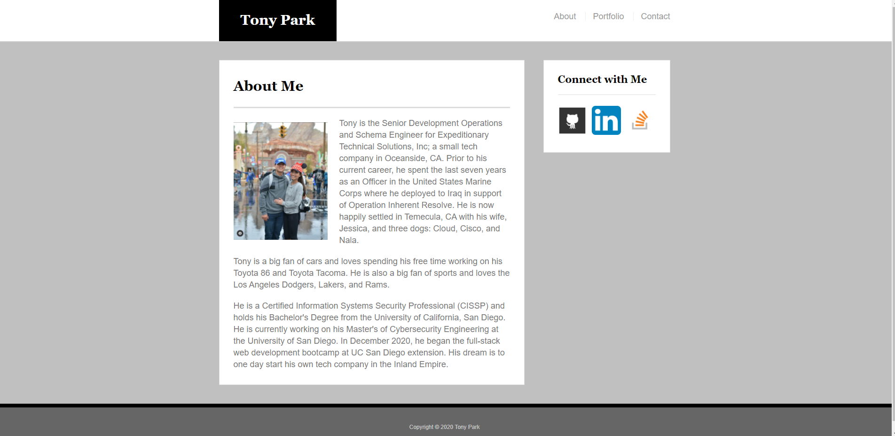
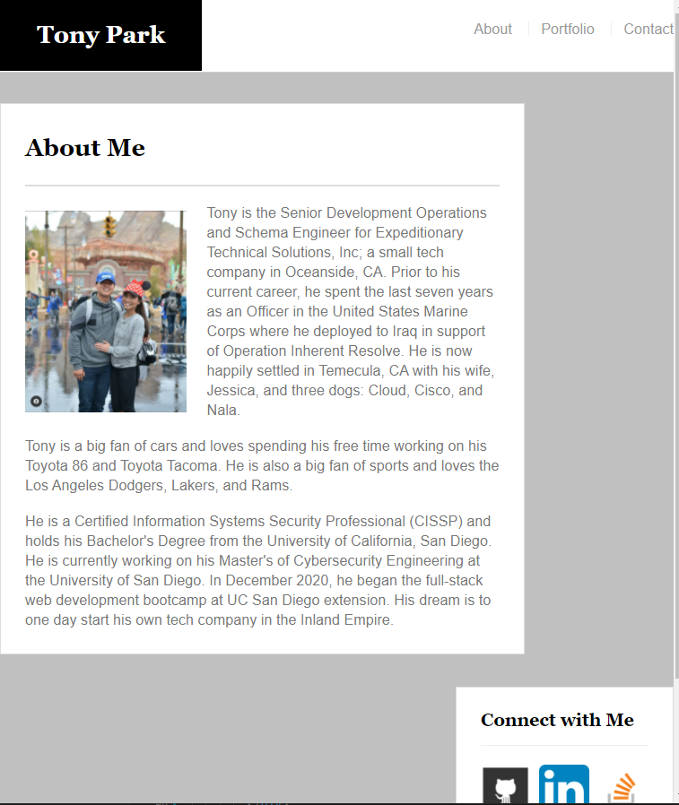
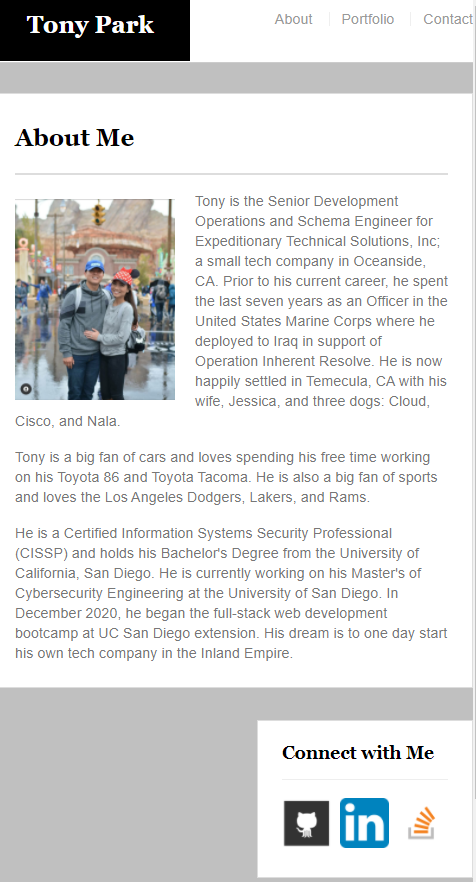

#################
Update on 2/11/2021
For the revision of the portfolio assignment, I created another GitHub to showcase my new front page at: [Click here](https://tonyrpark.github.io/Tony-Main-Portfolio/) 
# 02-bootstrap-css-tonypark

# Bootstrap-Portfolio

## Overview
For this project, I've re-created the simple portfolio done for the [Basic Portfolio](https://github.com/tonyrpark/02-bootstrap-css-tonypark) assignment using the Boostrap CSS framework

[Click here](https://tonyrpark.github.io/02-bootstrap-css-tonypark/) to launch the old version of this project in GitHub Pages

## Built with
* HTML
* CSS
* Bootstrap CSS Framework

## Bootstrap Components Used
* masthead - `.nav`, `.navbar-header`, `.navbar-brand`
* grid layout - `.container`, `.row`, `.col-[size]-*`
* contact form - `.form-group`, `.form-control`, `.btn`
* portfolio page - `.thumbnail`, `.img-responsive`

## Screenshots

 Large Screenshot 

 Medium Screenshot 

 

 Small Screenshot 

